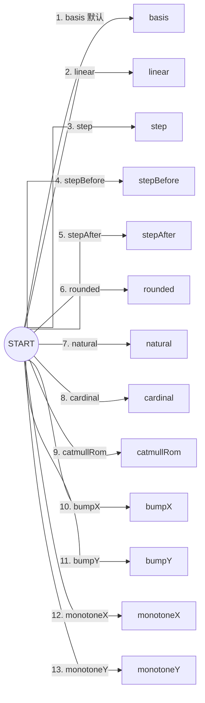

# 📚️ Web Reader

Web Reader 是一个轻量、现代化、全功能包含的 Web 文件树阅读与 Markdown 编辑器。它基于 **Go 1.24** 与 **Vue 3** 开发，全量前端生产资源直接内嵌在单个二进制文件中，发布部署无需在服务器上安装 Node.js 或前端运行环境。

---

## ✨ 核心特性

- **📦 单二进制部署**：前端与 Go 后端编译为单个极简可执行文件，无外部依赖，随拿随用。
- **📚️ 动态 Workspace 模式**：
  - 启动时自动解析并创建默认 `~/workspace` 目录（非 root 用户为 `/home/username/workspace`，root 用户为 `/root/workspace`）。
  - 支持通过右上角 **User 菜单 ⚙️ 设置 (Settings)** 随时动态切换服务器上的任意绝对路径 workspace。
- **📑 多文档标签页工作台 (Tabs System)**：
  - 支持多标签同时打开与切换，支持固定标签页 (Pin Tabs) 防止误关。
  - 标签页上下文菜单支持关闭、关闭其他、关闭右侧、关闭所有及复制相对/绝对路径。
  - 支持键盘快捷键：`Ctrl+W` 快速关闭当前标签，`Alt+←` / `Alt+→`（或 `PageUp` / `PageDown`）快速切标签。
  - 内置最近打开文件历史记录 (Recent Files)，快速回溯工作上下文。
- **✍️ 现代化 Markdown 编辑与知识库**：
  - 支持 **👁 预览**、**✏️ 编辑** 与 **📑 分屏** 三种视图，双向平滑同步滚动与互斥焦点保护。
  - 完备的 Markdown 格式化工具栏，支持撤销/重做栈 (`Ctrl+Z` / `Ctrl+Y`) 与智能包裹/解包。
  - **双向知识链接**：完整支持 `[[文档名]]`、`[[文档名#章节]]` 与 `[[文档名|别名]]`，平滑跳转打造本地知识库。
  - **便捷图片上传**：支持直接粘贴截图或拖拽图片文件，自动上传至当前目录的 `assets/` 目录并插入相对路径引用。
  - **本地草稿容灾**：编辑中自动保存本地草稿，异常关闭或刷新后可一键恢复。
- **🌳 增强型文件树与上下文操作**：
  - 类似 VS Code 的丰富上下文菜单：支持空白区与节点右键操作（新建文件/目录、重命名、删除、下载 ZIP、复制绝对/相对路径、一键折叠所有文件夹）。
  - 完善的拖拽交互：支持节点拖拽移动目录 (Drag & Drop Move) 及系统外部文件拖拽上传。
  - 路径面包屑导航，点击文件夹行即可直接进入子目录。
- **📊 富文本与高级图表支持**：
  - **KaTeX 数学公式**：完整支持 inline `$...$`、`\(...\)` 与 display `$$...$$`、`\[...\]`。
  - **Mermaid 交互图表**：支持平移、缩放、旋转、导出透明/白底 PNG、复制 SVG/源码，并自适应容器宽度。
  - **代码查看器**：自动识别主流语言高亮，带独立行号、一键复制与自动换行 (Word Wrap) 切换。
  - **文章大纲与相对路径**：支持 TOC 大纲联动跳转、自动解析 Markdown 相对图片与本地链接，安全格式化展示 `file://` URI。
- **💻 跨平台浏览器终端 (Web Terminal)**：
  - 内置基于 Go-PTY 与 XTerm.js 的交互式终端（支持 Linux / macOS / Windows），可在工作区路径下直接运行 shell（可在设置中随时启用或关闭）。
- **🔒 安全保障与权限控制**：
  - 单管理员账号认证，基于 bcrypt 密码哈希与安全的 HttpOnly 内存 session。
  - 严密防范路径穿越（Path Traversal）与越界符号链接（Symlink Escaping / `O_NOFOLLOW`）。
- **📱 响应式 UI 与主题**：
  - 完美适配 PC 桌面与移动端设备（移动端支持轻量抽屉导航与流畅动画）。
  - 内置 **☀️ 日间模式**、**🌙 夜间模式** 与 **💻 跟随系统主题**。

---

## 📊 Mermaid 流程图连线类型（flowchart.curve）

Web Reader 内嵌的 Mermaid（11.x）支持用 `flowchart.curve` 控制流程图（flowchart）连接线的渲染观感。项目默认在 `web/src/components/MarkdownViewer.vue` 中设置 `flowchart: { htmlLabels: false, curve: 'rounded' }`，即默认 **圆角折线**；当图中连接线较多显得杂乱时，建议改用直线/折线类（`linear`、`step*`、`rounded`）以提升可读性。

> 可通过以下三种方式调整：
> 1. **全局默认（项目级）**：修改 `web/src/components/MarkdownViewer.vue` 中 `mermaid.initialize` 的 `flowchart.curve` 字段；
> 2. **单张图（图内指令）**：在 Mermaid 代码块首行加入 `%%{init: {"flowchart": {"curve": "linear"}}}%%`；
> 3. **单条边（逐边指定）**：在边上使用 `edgeId@{ curve: 类型 }` 语法单独指定该条边的曲线类型。

### 一、支持的 `curve` 类型列表

| 类型 | 说明 | 特点 / 适用场景 |
| :--- | :--- | :--- |
| **`basis`** *(默认值)* | B-样条平滑曲线 | 柔和的弧线，不一定穿过控制点，Mermaid 默认渲染方式 |
| **`linear`** | 直线 / 折线 | 节点与拐点之间用直线直连（无平滑弧度） |
| **`step`** | 阶梯折线（中间转折） | 水平与垂直交替，在两点正中间转折 |
| **`stepBefore`** | 阶梯折线（先转折） | 水平/垂直阶梯连线，转折点靠近起点 |
| **`stepAfter`** | 阶梯折线（后转折） | 水平/垂直阶梯连线，转折点靠近终点 |
| **`rounded`** | 圆角折线 | 类似阶梯/正交折线，但在拐角处具有圆角平滑过渡 |
| **`natural`** | 自然三次样条曲线 | 一条穿过所有点的平滑三次样条曲线 |
| **`cardinal`** | Cardinal 样条曲线 | 穿过所有控制点的样条曲线 |
| **`catmullRom`** | Catmull-Rom 样条曲线 | 类似于 Cardinal，张力更平滑自然 |
| **`bumpX`** | 水平凸起曲线（S 形平滑） | 适合从左到右（LR / RL）排列的平滑贝塞尔曲线 |
| **`bumpY`** | 垂直凸起曲线（S 形平滑） | 适合从上到下（TB / TD）排列的平滑贝塞尔曲线 |
| **`monotoneX`** | 单调 X 三次曲线 | 保持 X 方向单调性，避免过冲波动（适合横向流） |
| **`monotoneY`** | 单调 Y 三次曲线 | 保持 Y 方向单调性，避免过冲波动（适合纵向流） |

### 二、示例（用 Edge ID 逐边指定 13 种 curve）



---

## 🛠️ 环境要求（仅源码编译）

若直接使用 release 发布的预编译二进制文件，**无需安装任何依赖**。若需从源码构建：

- **Go 1.24+**
- **Node.js 20+**
- **pnpm 11+**

---

## 🚀 普通 Linux 用户快速部署指南

适合绝大多数个人 Linux 服务器、虚拟机或 WSL 用户，无需 root 权限即可快速启动使用。

### 1. 下载预编译二进制

从 GitHub Releases 页面下载适合您系统架构的最新压缩包并解压：

```bash
# 示例：Linux x86_64
wget https://github.com/<owner>/web_reader/releases/download/v1.0.0/web-reader-v1.0.0-linux-amd64.tar.gz
tar -zxvf web-reader-v1.0.0-linux-amd64.tar.gz
cd dist_bin
```

### 2. 生成管理员密码哈希

使用交互式命令生成加密密码，避免明文密码出现在 shell 历史记录中：

```bash
./web-reader hash-password
```

根据提示输入并确认密码，程序将输出类似于 `$2a$10$e8Z...` 的 bcrypt 哈希字符串。复制该哈希备用。

### 3. 运行服务

#### 方式 A：直接前台启动

无需显式指定 `--workspace`，程序会自动在当前用户家目录下创建并使用 `~/workspace` 目录：

```bash
export WEB_READER_ADMIN_PASSWORD_HASH='$2a$10$e8Z...'
./web-reader
```

控制台将输出：

```text
2026/07/22 16:30:00 Workspace dir resolved: /home/username/workspace
2026/07/22 16:30:00 Web Reader listening on http://0.0.0.0:8848
```

此时打开浏览器访问 `http://<your-server-ip>:8848` 即可使用管理员账号（默认 `admin`）登录。

#### 方式 B：nohup 后台运行

```bash
export WEB_READER_ADMIN_PASSWORD_HASH='$2a$10$e8Z...'
nohup ./web-reader > web-reader.log 2>&1 &
```

#### 方式 C：普通用户 systemd 服务（推荐，支持开机自启）

无需 root / sudo 权限即可建立持久化守护进程：

1. 创建用户服务目录并新建配置文件：
   ```bash
   mkdir -p ~/.config/systemd/user/
   nano ~/.config/systemd/user/web-reader.service
   ```

2. 写入以下内容（替换密码哈希与路径）：
   ```ini
   [Unit]
   Description=Web Reader Service
   After=network.target

   [Service]
   Type=simple
   ExecStart=%h/bin/web-reader --addr 0.0.0.0:8848
   Environment="WEB_READER_ADMIN_PASSWORD_HASH=$2a$10$e8Z..."
   Restart=always
   RestartSec=5s

   [Install]
   WantedBy=default.target
   ```

3. 启动服务并开启开机自启（需开启用户 session 驻留）：
   ```bash
   systemctl --user daemon-reload
   systemctl --user enable --now web-reader
   
   # 允许用户离线时后台服务继续运行
   loginctl enable-linger $USER
   ```

4. 查看服务状态：
   ```bash
   systemctl --user status web-reader
   ```

---

## ⚙️ 进阶配置说明

服务支持通过命令行参数或环境变量进行配置。命令行参数优先级高于环境变量。

| 命令行参数 | 环境变量 | 默认值 | 说明 |
| --- | --- | --- | --- |
| `--addr` | `WEB_READER_ADDR` | `0.0.0.0:8848` | HTTP 服务监听地址 |
| `--workspace` | `WEB_READER_WORKSPACE` | `~/workspace` | 只读文件空间根目录（自动展开波浪号 `~`） |
| `--admin-user` | `WEB_READER_ADMIN_USERNAME` | `admin` | 管理员登录用户名 |
| `--password-hash` | `WEB_READER_ADMIN_PASSWORD_HASH` | 无 | **必填**，bcrypt 加密密码哈希 |
| `--session-ttl` | `WEB_READER_SESSION_TTL` | `24h` | 登录 Session 有效期 |
| `--max-text-size` | `WEB_READER_MAX_TEXT_SIZE` | `10MiB` | 在线文本预览与编辑的文件大小上限（上限 256MiB） |
| `--max-upload-size` | `WEB_READER_MAX_UPLOAD_SIZE` | `20MiB` | 文件上传（保存）的大小上限（上限 256MiB） |
| `--secure-cookie` | `WEB_READER_SECURE_COOKIE` | `false` | 使用 HTTPS 部署时请开启该参数 |

### 💡 在线动态变更 Workspace

登录 Web UI 后，点击右上角管理员用户名 -> **⚙️ 设置 (Settings)**，在弹出的控制面板中可直接输入服务器上的绝对路径并保存。后端将自动校验并切换生效，且会将您的设置持久化保存在 `~/.config/web-reader/settings.json` 中。出于安全考虑，敏感系统目录（如 `/etc`、`/root`、`/proc`、`/sys`、`/usr` 等）会被拒绝，以防止工作区被重定向到主机关键路径。

---

## 🛡️ 系统级 (root) 部署参考

对于需要全系统统一管理的生产环境，可参考 repository 内提供的系统级 systemd 模板：

- `deploy/web-reader.service`
- `deploy/web-reader.env.example`

部署步骤：

```bash
# 1. 创建专用独立系统用户
sudo useradd --system --home /nonexistent --shell /usr/sbin/nologin web-reader

# 2. 安装可执行文件与目录结构
sudo install -d -o root -g root /opt/web-reader
sudo install -m 0755 build/web-reader /opt/web-reader/web-reader
sudo install -d -o root -g web-reader -m 0750 /etc/web-reader
sudo install -o root -g web-reader -m 0640 deploy/web-reader.env.example /etc/web-reader/web-reader.env
# 创建并授权 workspace 目录（systemd 单元中的 ReadWritePaths 必须可写）
sudo install -d -o web-reader -g web-reader -m 0750 /srv/books
sudo install -m 0644 deploy/web-reader.service /etc/systemd/system/web-reader.service

# 3. 编辑配置并启动
sudo nano /etc/web-reader/web-reader.env
sudo systemctl daemon-reload
sudo systemctl enable --now web-reader
```

> **注意**：systemd 服务单元通过 `ProtectSystem=strict` 与 `ProtectHome=true` 做了强隔离，因此 **workspace 根目录与持久化配置目录必须显式列入 `ReadWritePaths`**。默认模板允许写入 `/srv/books`（workspace）与 `/etc/web-reader`（运行时设置 `settings.json`，通过 `XDG_CONFIG_HOME` 定向）。若你把 `WEB_READER_WORKSPACE` 指向其他路径，请同步修改 service 文件中的 `ReadWritePaths`。

---

## 🛠️ 本地开发与从源码构建

```bash
# 1. 安装前端依赖
make install

# 2. 校验代码格式与 Linter
make lint

# 3. 运行前端与后端单元测试
make test

# 4. 一键构建包含生产前端资源的二进制文件
make build
```

编译产物位于 `build/web-reader`。

---

## 📦 GitHub Release 跨平台构建说明

仓库包含了 `.github/workflows/release.yml` 自动化构建工作流。当推送形如 `v1.x.x` 的 Git Tag 时，GitHub Actions 会自动编译生成以下架构的可执行压缩包并自动发布 Release：

- **Windows (x64)**: `web-reader-vX.Y.Z-windows-amd64.zip`
- **Linux (x64)**: `web-reader-vX.Y.Z-linux-amd64.tar.gz`
- **Linux (ARM64)**: `web-reader-vX.Y.Z-linux-arm64.tar.gz`
- **macOS (Intel)**: `web-reader-vX.Y.Z-darwin-amd64.tar.gz`
- **macOS (Apple Silicon)**: `web-reader-vX.Y.Z-darwin-arm64.tar.gz`

---

## 🔐 安全须知

1. **HTTPS 建议**：明文 HTTP 会暴露 Session Cookie。在公网环境部署时，强烈建议配置 Nginx / Caddy 反向代理并开启 HTTPS（同时设置 `WEB_READER_SECURE_COOKIE=true`）。
2. **密码哈希保护**：不要将密码明文或环境变量中的密码哈希提交至公共代码仓库。
3. **符号链接防护**：后端防范任何指向 Workspace 根目录外部的符号链接或相对路径穿透行为。
