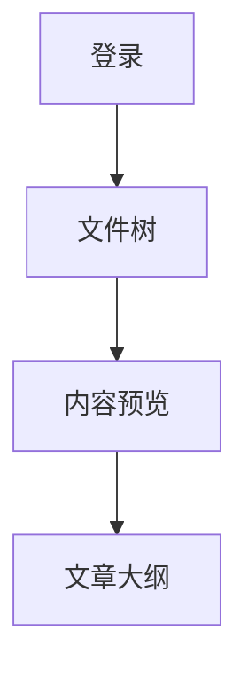

# Web Reader 验收文档

这是一份覆盖首版核心能力的 Markdown 示例。


[下一章](./chapter2.md#第二章) · [JSON 配置](./config.json) · [下载示例](./archive.bin)

## 公式

行内公式：\(a^2+b^2=c^2\) 与 $e^{i\pi}+1=0$。

$$
\int_0^1 x^2\,dx=\frac{1}{3}
$$

\[
\sum_{k=1}^{n} k=\frac{n(n+1)}{2}
\]

## 代码

```ts
interface Reader {
  readonly workspace: string
}

const ready: boolean = true
```

```unknown-language
<unsafe> stays escaped & readable
```

## Mermaid



## 表格与任务

- [x] 登录和会话
- [x] 文件预览
- [ ] 远程服务器实机验收

| 能力 | 状态 |
| --- | --- |
| Markdown | 可用 |
| 图片 | 可用 |
| Mermaid | 可用 |

## 重复标题

第一个重复标题。

## 重复标题

第二个重复标题，用于验证唯一锚点。
