# Mermaid 图表验收

## Sequence

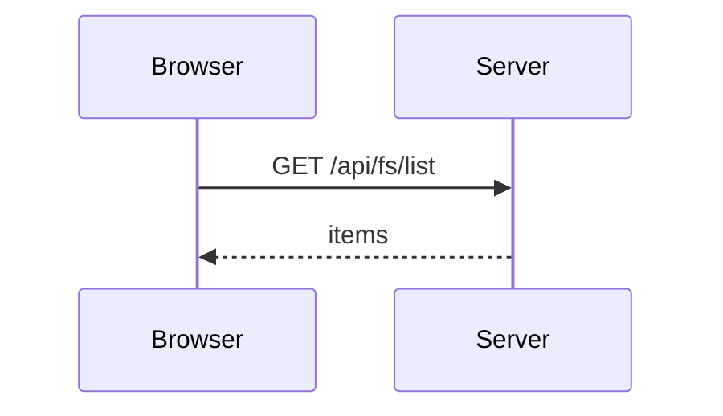

## Class

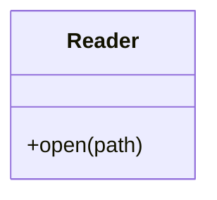

## State

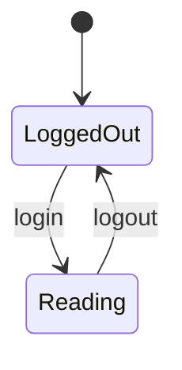

## ER

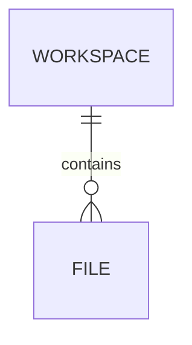

## Journey

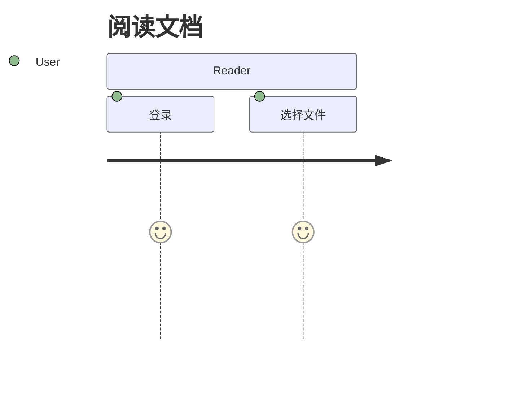

## Gantt

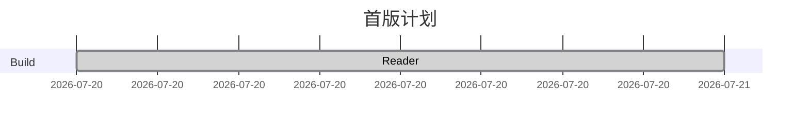

## Pie

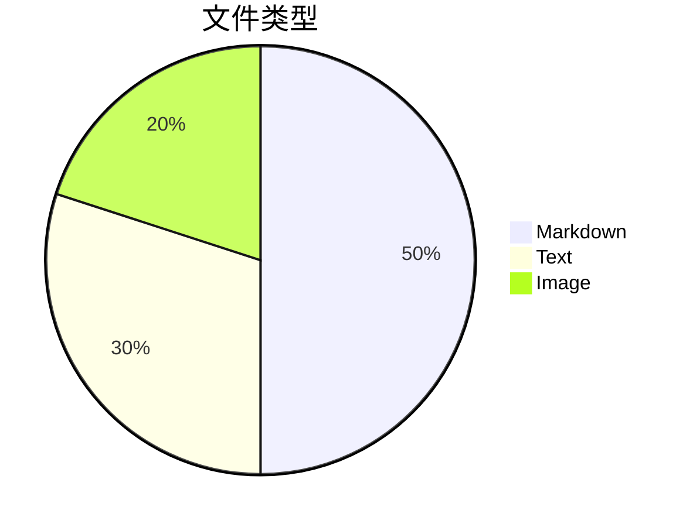

## Git graph

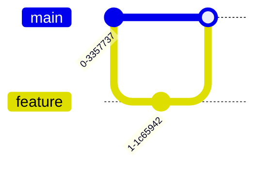

## Mindmap

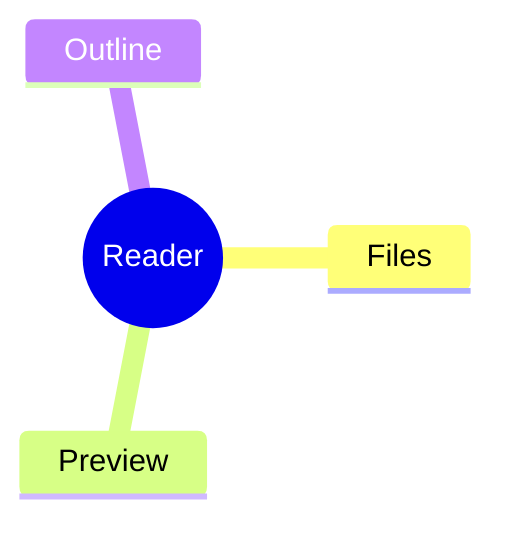

## Timeline

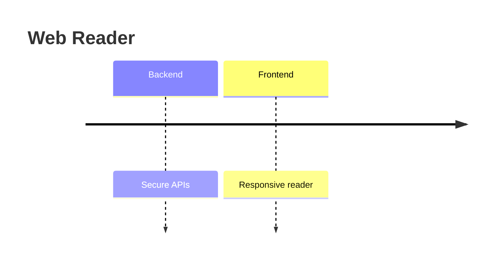

## Quadrant

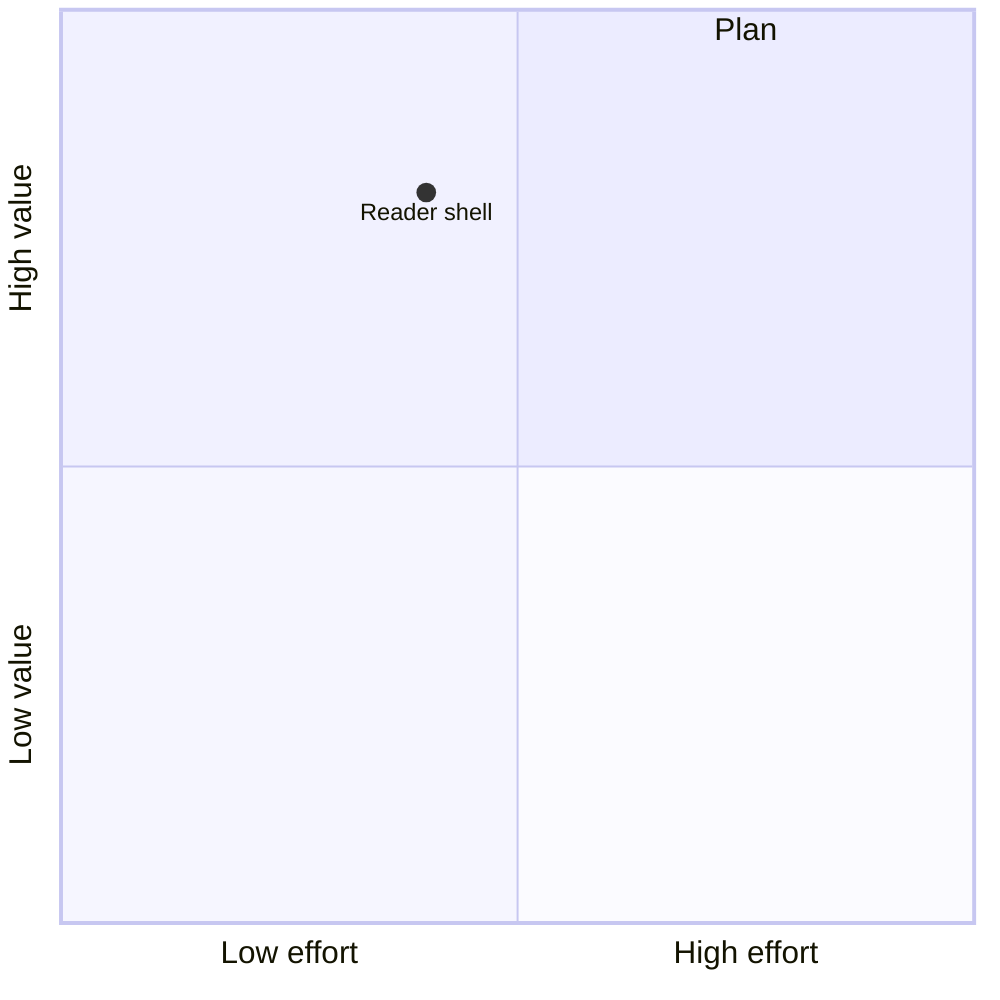

## XY

```mermaid
xychart-beta
  x-axis [1, 2, 3]
  y-axis "Files" 0 --> 3
  line [1, 2, 3]
```
